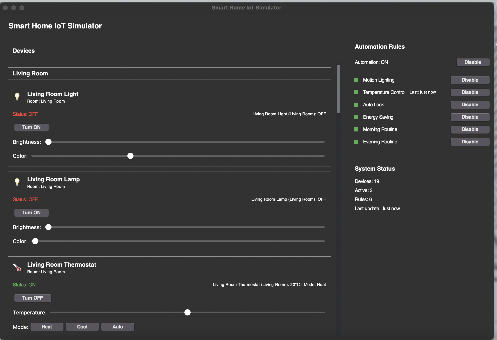

# Smart Home IoT Simulator

A Python-based application that simulates a smart home environment with various IoT devices, automation rules, and a modern graphical user interface.



## Features

- **Multiple Device Types**: Control lights, thermostats, cameras, doors, windows, and fans
- **Real-time Monitoring**: View device status updates in real-time
- **Automation Rules**: Create and manage rules for automated device control
- **Modern UI**: Clean, intuitive interface with color indicators and device cards
- **Room-based Organization**: Devices are grouped by room for easier management
- **Visual Feedback**: Color indicators reflect device states and conditions

## Device Types

| Device | Features |
|--------|----------|
| Smart Light | Brightness control, color temperature adjustment |
| Thermostat | Temperature control, heating/cooling modes |
| Security Camera | Motion detection, recording capabilities |
| Smart Door | Lock/unlock control, open/close functionality |
| Smart Window | Open/close percentage, blinds control |
| Smart Fan | Speed settings, oscillation control, timer |

## Automation Capabilities

The system includes several pre-configured automation rules:

- **Motion Lighting**: Automatically turn on lights when motion is detected
- **Temperature Control**: Maintain a comfortable temperature
- **Security**: Lock doors when no motion is detected
- **Energy Saving**: Turn off devices when not needed
- **Morning Routine**: Adjust devices for morning activities
- **Evening Routine**: Prepare the home for evening and night

## System Architecture

The application is built with a modular architecture:

- **Device Management**: Hierarchical class structure for IoT devices
- **Automation System**: Flexible rule-based automation framework
- **User Interface**: Modern, responsive dashboard with real-time updates

## Requirements

- Python 3.6+
- tkinter (included with most Python installations)
- Pillow (PIL Fork) for image processing

## Installation

1. Clone the repository:
   ```
   git clone https://github.com/2001J/Smart-Home-IoT-Simulator
   cd Smart-Home-IoT-Simulator
   ```

2. Set up a virtual environment (recommended):
   
   **For Unix/macOS:**
   ```bash
   python3 -m venv venv
   source venv/bin/activate
   ```
   
   **For Windows:**
   ```cmd
   python -m venv venv
   venv\Scripts\activate
   ```

3. Install dependencies:
   ```
   pip install -r requirements.txt
   ```
   
   Or install directly:
   ```
   pip install pillow>=9.0.0
   ```

4. Run the application:
   ```
   python -m main
   ```

## Project Structure

```
smart_home_iot/
├── devices/
│   └── smart_devices.py    # Device class definitions
├── utils/
│   └── automation.py       # Automation system and rules
├── ui/
│   └── dashboard.py        # User interface components
├── main.py                 # Main application entry point
├── requirements.txt        # Project dependencies
└── README.md               # This file
```

## Usage

1. Launch the application using `python -m main`
2. The dashboard will display all devices organized by room
3. Use the controls to adjust device settings
4. Toggle automation rules on/off as needed
5. Monitor device status in real-time

## Customization

You can easily extend the system:

- Add new device types by extending the `SmartDevice` class
- Create custom automation rules by defining condition and action functions
- Modify the UI by adjusting the dashboard layout and components

## Future Enhancements

- Data logging and analytics
- Weather integration
- Voice control capabilities
- Mobile application integration
- Machine learning for predictive automation

## License

This project is licensed under the MIT License - see the [LICENSE](LICENSE) file for details.

## Acknowledgments

- This project was created as an educational demonstration of IoT concepts
- Inspired by real-world smart home systems and automation platforms 